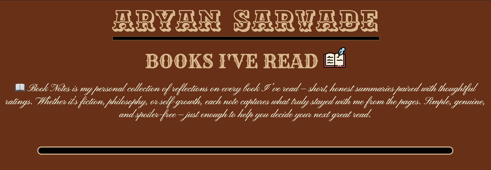

# 📚 Book Notes

**Book Notes** is a personal web app built to record and reflect on every book I’ve read — complete with short summaries, personal ratings, and key details like author, cover, and publication date.  
Inspired by Derek Sivers’ reading notes idea, this project fetches book data automatically using the **Google Books API** and stores it in a **PostgreSQL database**.

---

## 🖼️ Project Preview

### 🧩 Homepage Layout



### 📘 Book Display Example


---

## 🚀 Features

- Fetches book details dynamically from **Google Books API**
- Stores book data (title, author, date, cover, rating, summary) in **PostgreSQL**
- Auto-generates random book entries for variety
- Displays books in a modern UI built with **EJS templates**
- Includes custom typography, hover transitions, and scroll-triggered animations
- Fully responsive and optimized for visual clarity

---

## 🛠️ Tech Stack

| Category      | Technology                 |
| ------------- | -------------------------- |
| **Backend**   | Node.js, Express           |
| **Frontend**  | EJS, HTML, CSS, JavaScript |
| **Database**  | PostgreSQL                 |
| **API**       | Google Books API           |
| **Styling**   | Custom CSS, Google Fonts   |
| **Animation** | Intersection Observer API  |

---

## 📂 Folder Structure

```
Book-Notes/
├── index.js              # Main Express server
├── package.json          # Project dependencies
├── queries.sql           # Database schema and queries
├── views/
│   └── index.ejs         # Main template
├── public/
│   ├── main.css          # Styling
│   ├── script.js         # Scroll animations & interactions
│   └── images/           # Screenshots, icons, etc.
└── README.md             # Documentation
```

---

## ⚙️ Setup Instructions

### 1️⃣ Clone the Repository

```bash
git clone https://github.com/aryansarvade/book-notes.git
cd book-notes
```

### 2️⃣ Install Dependencies

```bash
npm install
```

### 3️⃣ Configure the Database

Make sure PostgreSQL is installed and running.  
Create a database named `book_notes`:

```sql
CREATE DATABASE book_notes;
```

Then create the required table:

```sql
CREATE TABLE books (
  id SERIAL PRIMARY KEY,
  title TEXT,
  authors TEXT,
  thumbnail TEXT,
  published_date TEXT,
  keyword TEXT,
  rating NUMERIC,
  summary TEXT
);
```

---

### 4️⃣ Add Environment Variables

Create a `.env` file in the root folder:

```env
GOOGLE_API_KEY=your_google_books_api_key
DB_USER=postgres
DB_PASS=yourpassword
DB_NAME=book_notes
DB_PORT=5432
```

---

### 5️⃣ Run the Application

```bash
nodemon index.js
```

Then open [http://localhost:3000](http://localhost:3000) in your browser 🚀

---

## 🧠 How It Works

1. **Random Book Fetching**  
   When you start the app, it picks random topics (like _history_, _science_, _fiction_) and queries the Google Books API for book data.

2. **Database Insertion**  
   The results are stored in your PostgreSQL database — with columns for title, authors, thumbnail, published date, keyword, rating, and summary.

3. **Dynamic Rendering**  
   All stored books are displayed dynamically in your `index.ejs` template with cover images, titles, author names, and personalized notes.

---

## 🗾 Example Database Entry

| title           | authors           | rating | summary                                                                              |
| --------------- | ----------------- | ------ | ------------------------------------------------------------------------------------ |
| _Atomic Habits_ | James Clear       | 4.8    | A practical guide to building small habits that compound into life-changing results. |
| _Sapiens_       | Yuval Noah Harari | 4.6    | A profound exploration of how human history, biology, and culture intertwine.        |

---

## 📚 Future Enhancements

- Add a user login system for personalized notes
- Add “Add New Book” form with custom summaries
- Implement search and filtering by rating or author
- Integrate dark/light mode toggle

---

## 👨‍💻 Author

**Aryan Sarvade**  
📧 [aryan.sarvade@example.com](mailto:aryan.sarvade@example.com)  
💻 Built with ❤️, ☕, and curiosity.

---

## 📝 License

This project is licensed under the **MIT License** — feel free to fork, modify, and learn from it!

---

## 🌟 Acknowledgments

- [Google Books API](https://developers.google.com/books/docs/v1/using)
- [Derek Sivers’ Book Notes Concept](https://sive.rs/book)
- [Node.js](https://nodejs.org/), [Express](https://expressjs.com/), [PostgreSQL](https://www.postgresql.org/)
- Fonts from [Google Fonts](https://fonts.google.com/)
